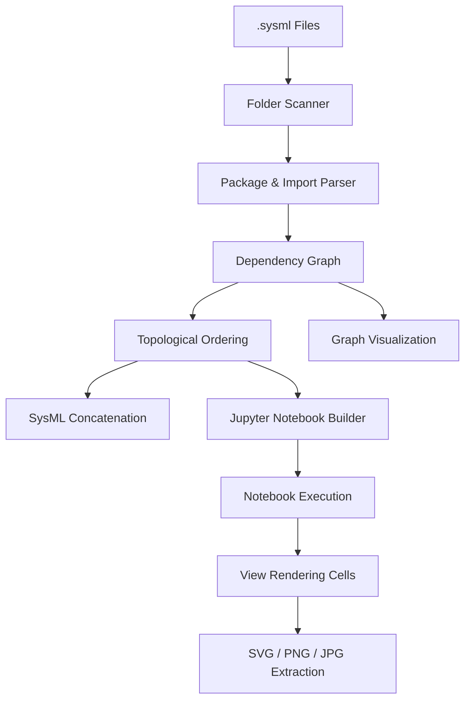

# Windseeker


[](https://pypi.org/project/sysml-windseeker/)
[](https://codecov.io/gh/Westfall-io/windseeker)


**Windseeker** is a command-line tool for **SysML v2 dependency analysis, notebook generation, execution, and view extraction**.

It scans `.sysml` files, analyzes package dependencies, generates a dependency-ordered SysML Jupyter notebook, executes that notebook using a SysML kernel, and extracts rendered **views** as images.

## Why would you use this?
It allows you to develop SysMLv2 models using SysIDE-like environments where models are split over multiple files and still generate graphical views via PlantUML from the Jupyter SysML reference implementation kernel **without** constant refactors.

> **Naming note**
>
> - **PyPI distribution name:** `sysml-windseeker`
> - **Python import name:** `windseeker`
> - **CLI command:** `windseeker`

---

## AI Assisted Development

This project has used generative AI to assist in the development of the tool.

---

## 🧱 Architecture Overview



---

## ✨ Features

### Model Analysis
- Recursively scans `.sysml` files
- Extracts **top-level packages only**
- Detects `import` dependencies
- Builds a directed dependency graph
- Fails fast on:
  - Import cycles
  - Invalid dependency ordering

### Notebook Generation
- Generates a **single-kernel SysML Jupyter notebook**
- One **code cell per top-level package**
- Cells ordered by **dependency order**
- Nested packages remain embedded in their parent cell
- Appends additional cells for each discovered `view`
  - Uses `%view Fully::Qualified::ViewName`

### Notebook Execution
- Executes the generated notebook programmatically
- Supports:
  - `nbclient` (preferred)
  - `jupyter nbconvert --execute` (fallback)
- Detects errors via:
  - Jupyter `error` outputs
  - SysML kernel `stderr` (`ERROR`, `Exception`, `Traceback`)
- View rendering failures are **non-fatal by default**

### View Image Extraction
- Extracts rendered views from executed notebooks
- Supports:
  - SVG (raw XML)
  - PNG (transparent or solid background)
  - Optional JPG
- Automatically rescales oversized SVGs to avoid Cairo rendering errors

---

## 🚀 Quick Start

### 1) Install Windseeker

```bash
pip install sysml-windseeker
```

For development:

```bash
pip install -e .
```

---

### 2) Ensure a SysML Jupyter Kernel Is Installed

```bash
jupyter kernelspec list
```

You must see a kernel such as:

```
sysml
```

---

### 3) Run Windseeker

```bash
windseeker run --folder ./tests
```

---

## 🧰 CLI Usage

### Common Options

| Flag | Description |
|-----|------------|
| `--folder PATH` | Root directory to scan for `.sysml` files |
| `--graph / --no-graph` | Enable or disable dependency graph image generation |
| `--execute / --no-execute` | Execute the generated notebook |
| `--export-views / --no-export-views` | Extract rendered views |
| `--views-dir PATH` | Output directory for view images |
| `--sysml-out PATH` | Output `.sysml` file |
| `--notebook-out PATH` | Output notebook path |

---

### Validation & Safety Flags

| Flag | Description |
|-----|------------|
| `--ignore-missing NAME` | Ignore unresolved imports (e.g. standard libraries) |
| `--strict-missing / --allow-missing` | Fail if unresolved imports are found |
| `--strict-views / --allow-view-errors` | Fail if `%view` cells error |
| `--execute / --no-execute` | Skip notebook execution |

---

### View Rendering Options

| Flag | Description |
|-----|------------|
| `--write-svg / --no-write-svg` | Write SVG files |
| `--write-png / --no-write-png` | Write PNG files |
| `--write-jpg / --no-write-jpg` | Also write JPG files |
| `--png-transparent / --png-opaque` | Control PNG transparency |
| `--png-bg COLOR` | Background color for opaque PNGs |

---

### Full CLI Reference

```bash
windseeker run --help
windseeker order --help
```

---

## 📜 License

MIT
